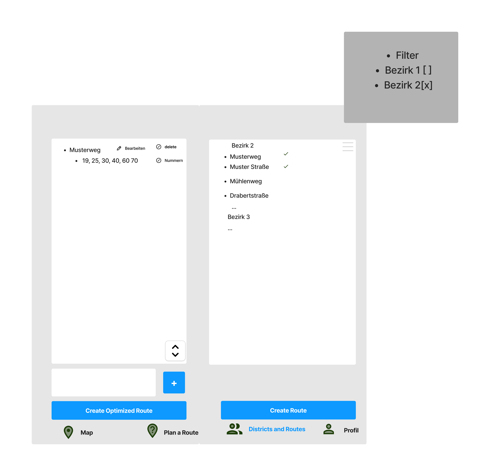
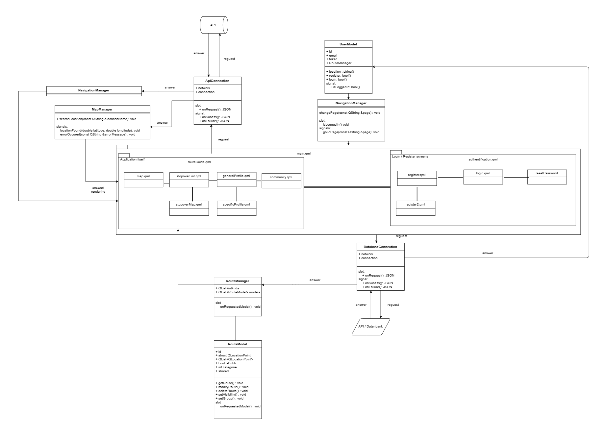

# Anforderungs- und Entwurfsspezifikation ("Pflichtenheft")
# 0 Titelseite
* Projektname: RouteGuide
* Autoren:
*   - Malte Kanders
    - Clemens Maas
* Inhaltsverzeichnis
# 1 Einführung
## 1.1 Beschreibung
* Ein Tool zum erstellen, speichern und veröffentlichen von Routen.
# 2 Anforderungen
## 2.1 Stakeholder
| Funktion / Relevanz | Name | Kontakt / Verfügbarkeit | Wissen | Interessen / Ziele |
|---|---|---|---|---|
|Product Owner|Brunsman|E-Mail|Allwissend|---|
|Backend Developer|Clemens Maas|E-Mail, Discord|Java, Rust, PG, Ruby, RabbitMQ|Eine gute Note|
|Frontend Developer|Malte Kanders|E-Mail, Discord|JS, UI/UX, |Vereinfachung des Nebenjobs|
|Endnutzer|Endnutzer|Support|-|Vereinfachung des Jobs, Nutzen fuer Freizeitaktivitaeten|
| | | | | |
## 2.2 Funktionale Anforderungen
Jeder User:

Premium User:

Arbeiter:

## 2.3 Nicht-funktionale Anforderungen
### 2.3.1 Rahmenbedingungen
* Normen, Standards, Protokolle, Hardware, externe Vorgaben
### 2.3.2 Betriebsbedingungen
* Getestete Endgeräte :
  - Android (14)
  - Linux (Ubuntu)
  - Windows (10)
* Mögliche Weitere:
  - Ios
  - Tablets
* Nicht Möglich:
  - Web Anwendung durch Webassembly, da das benötigte Modul nicht,
  für Webassambly zur Verfügung steht.
### 2.3.3 Qualitätsmerkmale
* Externe Qualitätsanforderungen (z.B. Performance, Sicherheit, Zuverlässigkeit,
Benutzerfreundlichkeit)

Qualitätsmerkmal | sehr gut | gut | normal | nicht relevant |
| :------ | :------ | :----- | :------ | :------ |
**Zuverlässigkeit** |-|-|-|-|
Fehlertoleranz |X|-|-|-|
Wiederherstellbarkeit |-|X|-|-|
Ordnungsmäßigkeit |X|-|-|-|
Richtigkeit |X|-|-|-|
Konformität |-|-|X|-|
**Benutzerfreundlichkeit** |-|-|-|-|
Installierbarkeit |-|-|X|-|
Verständlichkeit |X|-|-|-|
Erlernbarkeit |X|-|-|-|
Bedienbarkeit |X|-|-|-|
**Performance** |-|-|-|-|
Zeitverhalten |x|-|X|-|
Effizienz|x |-|X|-|
**Sicherheit** |-|-|-|-|
Analysierbarkeit |-|-|-|X|
Modifizierbarkeit |-|-|-|X|
Stabilität |X|-|-|-|
Prüfbarkeit |-|-|-|X|

## 2.4 Graphische Benutzerschnittstelle
#### Übersicht

#### Login

Use Cases: 1, 2, 3
#### Map

Use Cases: 5, 6, 7, 8
#### Passwort vergessen

Use Case: 1
#### Neuer Nutzer, erste Seite

#### Neuer Nutzer, zweite Seite

Use Case: 4
#### Route planen, erste Seite

#### Route planen, zweite Seite

Use Cases: 16, 17, 18, 19
#### Profil, erste Seite

Use Case: 10, 11, 12, 13, 14
#### Profil, zweite Seite

Use Cases: 15
#### Community

Use Cases: 11, 14
#### Job Spezifisch

Use Cases: 22, 23, 24

Fehlendes: 
21, 25

## 2.5 Anforderungen im Detail

| ID | **Als** | **möchte ich** | **so dass** | **Akzeptanz** |
| :------ | :------ | :----- | :------ | :-------- |
| 1 | Wer | Was | Warum | Wann akzeptiert |
| 2 | Benutzer | einen Button für das zurücksetzen des Passwort | ich mir ein neues Passwort geben lassen kann | Passwort wird durch neues ersetzt |
| 3 | Benutzer | einen Button zum erstellen eines Profils | ich als neuer Nutzer ein neues Profil machen kann | Benutzer wird angelegt und beim Login erkannt |
| 4 | Backend  | keine Fehlerhaften Anfragen | bei fehlerhafter Mail keine Anfrage geschickt wird | Falsche Email wird nicht angenommen |
| 5 | Benutzer | den Grund für meine Anmeldung angeben | damit ich für mich passende Routen finde | User wird einer Gruppe zugeordnet |
| 6 | Benutzer | eine simple Kartenansicht | damit ich mich auf das wesentliche konzentrieren kann | Simple Karten Ansicht |
| 7 | Benutzer | bei einer Navigation eine sich mitbewegende Karte | damit ich immer genau weiß wo ich bin und lang will/muss | Mitbewegende Karte |
| 8 | System | standortfreigabe vom Nutzer | damit die Karte und die geteilten Routen in etwa zu dem User passen | Standort des Users bekommen |
| 9 | Benutzer | die Karte wieder auf den Nutzer zentrieren | damit man bei verschobener Karte sich wieder findet | Button der den Nutzer zentriert
| 10 | Benutzer | zwischen den Hauptanwendungen leicht hin und her wechseln können | damit die App nicht überfordert | Navigationsleiste mit wesentlichen Anwendungen |
| 11 | Premium Nutzer | die Möglichkeit bereits gefasste Routen zu speichern | damit ich Routen wiederholen kann | Speichermöglichkeit für Routen |
| 12 | Premium Nutzer | die Möglichkeit gespeicherte Routen mit anderen zu teilen | damit ich Routen von anderen ausprobieren kann und eigene teilen kann | Teil Möglichkeit von gespiecherten Routen |
| 13 | Premium Nutzer | bereits gefasste Routen wieder entfernen kann | so das ich meine Routen auch wieder löschen kann | Gespeicherte und/oder geteilte Routen löschen |
| 14 | Premium Nutzer | routen die ich geliked habe wiederfinden | ich mir gefallende Routen öfters aufrufen kann | Gelikede Routen in meinem Profil wiederfinden |
| 15 | System | routen sollen bewertet werden können | user gut bewertete Routen finden können | Ein User bestimmtes Bewertungssystem
| 16 | Premium Nutzer | mein Profil und meine Gruppe wechseln | um auch Routen zu erhalten die der User zuerst als unrelevant ansah | Eine Seite im Profil mit Tick Boxen |
| 17 | Benutzer | eine Route bestehend aus vielen Stops erstellen | um eine Route mit Zwischenstops erstellen zu können | Route aus einer Liste von Routen erstellen |
| 18 | Benutzer | Punkte auf der Kart anklicken um sie in die Routenplanung aufzunehmen | unabhängig von Straßen auch andere Wegpunkte setzen kann | Map Ansicht mit der Möglichkeit für Wegpunkte |
| 19 | Premium Nutzer / Angestellter | eine optimierte Route erstellen können | um aus mehreren Wegpunken eine Optimale Strecke zu erstellen | Erstellen einer optimierten Route mithilfe eines Buttons |
| 20 | Benutzer | eine Route erstellen die nicht optimiert ist | um eine Route auch so zu haben wie der Nutzer es wollte | Erstellen einer unoptimierten Route mithilfe eines Buttons |
| 21 | Firma | Bezirke aus einzelnen Straßen zusammenstellen | Fahrer die benötigten Straßen nur anzuklicken brauchen | Bezirke als Liste von Straßen erstellen |
| 22 | Angestellter | Straßen mit Hausnummern versehen | jeder einzelne Stopp mit aufgenommen wird | einzelne Straßen um Hausnummern erweitern |
| 23 | Firma | das nur Angestellte dürfen interne Bezirke kennen | nur authorisierte Personen sich unter der Firma anmelden können | Bspw. nur durch besondere Email Adresse Zugang zu Daten |
| 24 | Angestellter | das man aus mehreren Bezirken wählen kann | mir daraufhin alle Straßen des Bezirks angezeigt werden | Mehrauswahl der Bezirke |
| 25 | Firma | das Bezirke vorsortiert sind | sie mit der internen Planung zusammen passen können | Vorsortierte Bezirke |
| x | System | dauer der Route soll gespeichert werden | es eine Durschschnitt und Bestzeit gibt | Zeitmessung der Navigation |
| x | System | listen sollen intuitiv scrollbar sein | so das es im Prinzip unendlich lange Listen gibt | Scrollbare Listen |

# 3 Technische Beschreibung
## 3.1 Systemübersicht

## 3.2 Softwarearchitektur

### 3.2.1 Technologieauswahl
Frontend
  - QT als Crossplattform Framework
    - QT Quick 
    - QML für Views (JavaScript Eigenschaften)
    - C++ in der Logik Schicht
  - QT besitzt bereits ein Modul für Kartenabfragen über bspw OpenstreetMaps

Backend
  - Java + Spring als Authentifizierungsserver
  - Rust + Rocket als REST API
  - RabbitMQ als Message Broker
  - PostgreSQL als Datenbank
  - Redis als DB-Cache
  - TeamCity als CI/CD Pipeline
  - JS fuer den Hilfsbot
## 3.3 Schnittstellen
*
## 3.3.1 Ereignisse
  - Neu angelegte Listen:
    - Listentyp 
    - Erstellungsdatum
    - Ersteller/Benutzer
    - Listenname
    - Anzahl der Elemente in der Liste

  - Gelöschte Routen:
    - Routenname oder ID
    - Zeitpunkt des Löschvorgangs
    - Verantwortlicher/Benutzer, der die Route gelöscht hat
    - Verknüpfte Daten oder Ressourcen, die von der Route abhängen

  - Deaktivierte Konten
    - Kontoname oder ID
    - Zeitpunkt der Deaktivierung
    - Verantwortlicher/Benutzer, der das Konto deaktiviert hat
    - Status vor der Deaktivierung (aktiv/inaktiv)
    - Grund für die Deaktivierung
    - Verknüpfte Daten oder Ressourcen, die von dem Konto abhängen
  
* In Event-gesteuerten Systemen: Definition der Ereignisse und deren Attribute
## 3.4 Datenmodell

## 3.5 Abläufe
*
## 3.6 Entwurf
* Detaillierte UML-Diagramme für relevante Softwarebausteine
* 
## 3.7 Fehlerbehandlung

| Fehlercode | Fehlermeldung | Beschreibung | Lösung |
|---|---|---|---|
| 400 | Bad Request | Die Anfrage war fehlerhaft | Überprüfen Sie die Anfrage |
| 401 | Unauthorized | Der User ist nicht berechtigt | Überprüfen Sie die Berechtigungen |
| 403 | Forbidden | Der User hat keine Berechtigung | Überprüfen Sie die Berechtigungen |
| 404 | User not found | Der User konnte nicht gefunden werden | Überprüfen Sie die Eingabe |
| 405 | Method Not Allowed | Die Methode ist nicht erlaubt | Überprüfen Sie die Methode |
| 408 | Request Timeout | Die Anfrage hat zu lange gedauert | Versuchen Sie es später erneut |
| 429 | Too Many Requests | Der Server hat zu viele Anfragen erhalten | Versuchen Sie es später erneut |
| 500 | Server Error | Ein Server Fehler ist aufgetreten | Versuchen Sie es später erneut |
| 503 | Service Unavailable | Der Service ist nicht verfügbar | Versuchen Sie es später erneut |
| 504 | Gateway Timeout | Der Server hat zu lange gebraucht | Versuchen Sie es später erneut |
| 600 | User already exists | Der User existiert bereits | Überprüfen Sie die Eingabe |
| 601 | User not found | Der User konnte nicht gefunden werden | Überprüfen Sie die Eingabe |
| 602 | User not logged in | Der User ist nicht eingeloggt | Loggen Sie sich ein |
| 603 | User not authorized | Der User ist nicht berechtigt | Überprüfen Sie die Berechtigungen |
| 604 | Route not found | Die Route konnte nicht gefunden werden | Überprüfen Sie die Eingabe |
| 605 | Route already exists | Die Route existiert bereits | Überprüfen Sie die Eingabe |
| 606 | Route creation failed | Die Route konnte nicht erstellt werden | Überprüfen Sie die Eingabe |
| 607 | Route deletion failed | Die Route konnte nicht gelöscht werden | Überprüfen Sie die Eingabe |
| 608 | Route update failed | Die Route konnte nicht aktualisiert werden | Überprüfen Sie die Eingabe |

## 3.8 Validierung

* Relevante (Integrations)-Testfälle, die aus den Use Cases abgeleitet werden können
* Testfälle für
* Datenmodell
* API
* User Interface
* Fokussieren Sie mehr auf Integrationstestfälle als auf Unittests
* Es bietet sich an, die IDs der Use Cases / User Stories mit den Testfällen zu
verbinden, so dass erkennbar ist, ob Sie alle Use Cases getestet haben.
# 4 Projektorganisation
## 4.1 Annahmen
Nicht durch den Kunden definierte spezifische Annahmen, Anforderungen und
Abhängigkeiten

* Mehrsprachigkeit
* Hauptanwendungssprache: Englisch

* Aufteilung in Repositories gemäß Software- und Systemarchitektur und Softwarebausteinen
  
Einschränkungen, Betriebsbedingungen und Faktoren, die die Entwicklung beeinflussen
(Betriebssysteme, Entwicklungsumgebung)

* Krankheitsfall eines Teammitglieds
* Ausfall des Servers
* Unbekanntes Framework

Interne Qualitätsanforderungen (z.B. Softwarequalitätsmerkmale wie z.B.
Erweiterbarkeit)

* Hohe Codequalität (Lesbarkeit, Wartbarkeit, Testbarkeit)
* Gute Dokumentation
* Aussagende Commit-Nachrichten
* Hohe Testabdeckung im Backend
* Regelmäßige Besprechungen und evtl. Code-Reviews
* Hohe Performance der Navigation

## 4.2 Verantwortlichkeiten
* Zuordnung von Personen zu Softwarebausteinen aus Kapitel "Systemübersicht" und
"Softwarearchitektur"

### Rollenzuordnung
| Name | Rolle |
|----------|-----------|
| Malte Kanders | Frontend-Entwickler |
| Clemens Maas | Backend-Entwickler |
## 4.3 Grober Projektplan
- Meilensteine
### Meilensteine
* Abgabe Pflichtenheft
* Projekt aufsetzen
* Implementierung der Hauptfunktionalitäten
  - Kommunikation zwischen Front und Back
  - Erstellen von Routen
* Erstellen eines Prototypens
* Finale Implementirung und Software Demo
# 5 Anhänge
## 5.1 Glossar
* Definitionen, Abkürzungen, Begriffe
## 5.2 Referenzen
* Handbücher, Gesetze
* z.B. Datenschutzgrundverordnung
## 5.3 Index
